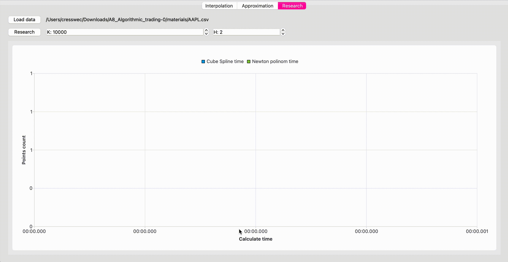

# Forex-analisys

Реализация проекта Forex-analisys. 

## Overview
Данная программа позволяет анализировать и прогнозировать котировочные данные с методами кубических сплайнов и полиномом Ньютона в зависимости от высчитываемых точек. 
Не является торговым инструментом. 
Автор не несет ответственности за результаты прогнозов, использованных в торговых сессиях.


## Contents

1. [Chapter I](#chapter-i) \
    1.1. [Start](#start) \
    1.2. [Interpolation](#interpolation) \
    1.3. [Approximation](#approximation) \
    1.4. [Research](#research)

## Chapter II

## Start

Для того чтобы начать работу, необходимо открыть файл, нажав на кнопку  `Open` в одной из трех вкладок приложения. Файл должен быть в формате `.csv` и содержать в себе столбцы с данными:
- Дата (формат: `yyyy-MM-dd`, обязательный)
- Значение функции (формат: `double`, обязательный)
- Вес (формат: `double`, необязательный)

Примеры входных данных:

```
Date,Close
2021-03-22,123.389999
2021-03-23,122.540001
2021-03-24,120.089996
...
```

```
Date,Close,Weight
2021-03-22,12.85,1.22387
2021-03-23,12.21,0.851246
2021-03-24,12.14,0.80462
...
```

## Interpolation

*Интерполяция* – способ нахождения промежуточных значений величины по имеющемуся дискретному набору известных значений.

`Интерполяционный многочлен ньютона (с возможностью выбрать степень полинома)` и `Интерполяция кубическими сплайнами` - два реализованных метода интерполяции в рамках проекта.

Пользователь может разместить в области графиков до пяти графиков одновременно.

Перемещение в области графика реализовано при зажатой клавише ПКМ. Если необходимо вернуться в исходное состояние необходимо дважды нажать клавишу ЛКМ.

Очистку можно выполнять путем нажатия клавиши `Clear all` (удалить все графики), либо нажать на поле `Remove` в списке графиков и удалить необходимый.

Пользователь также может получить значения двух методов, нажав на кнопку `Value from date` и выбрав необходимую дату.


## Approximation

*Аппроксимация* – замена одних математических объектов другими, в том или ином смысле близкими к исходным.

`Метод наименьших квадратов (с возможностью выбрать степень полинома)` - реализованый метод аппроксимации в проекте.

Пользователь может разместить в области графиков до пяти графиков одновременно.

Пользователь может задать значение `M` - которое означает на сколько дополнительных дней будут аппроксимироваться данные.

Пользователь также может получить значения двух методов, нажав на кнопку `Value from date` и выбрав необходимую дату.

Имеется возможность использовать веса точек, которые могут быть заданы во входном `.csv` файле. Для этого необходимо установить чекбокс `use users weights` во включенное положение.

Добавлена возможность построения одновременно следующих 4-х графиков:
- Со степенью полинома 1 для таблицы, в которой веса заданы пользователем
- Со степенью полинома 2 для таблицы, в которой веса заданы пользователем
- Со степенью полинома 1 для таблицы, в которой все веса равны 1
- Со степенью полинома 2 для таблицы, в которой все веса равны 1


## Research

Исследование временных характеристик интерполяций методами `кубических сплайнов` и `полиномом Ньютона` в зависимости от высчитываемых точек.

Пользователь устанавливает максимальное количество точек `k` и количество разбиений `h`. Минимальное число `k` - это количество записей во входной таблице. Измерения повторяются `h` раз, каждое выполняется 10 раз, и будет вычислено среднее арифметическое.


